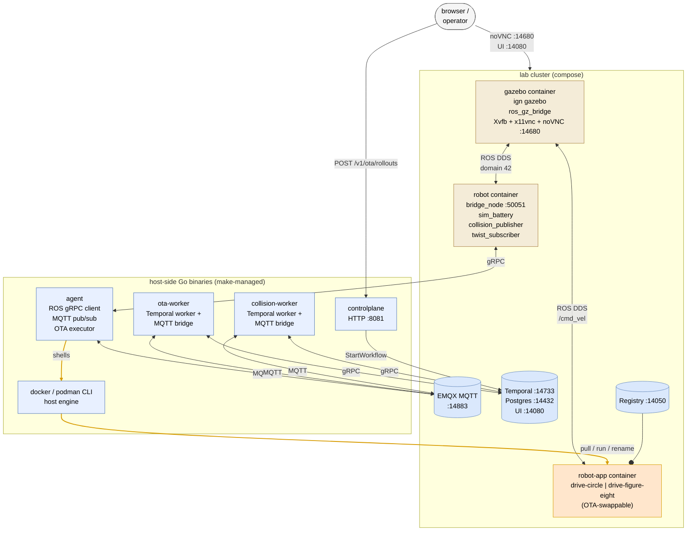
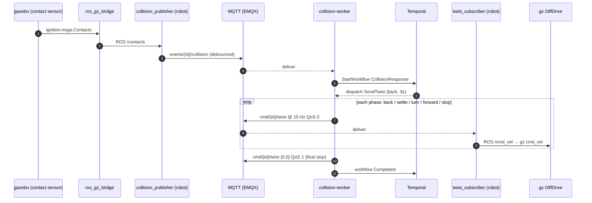
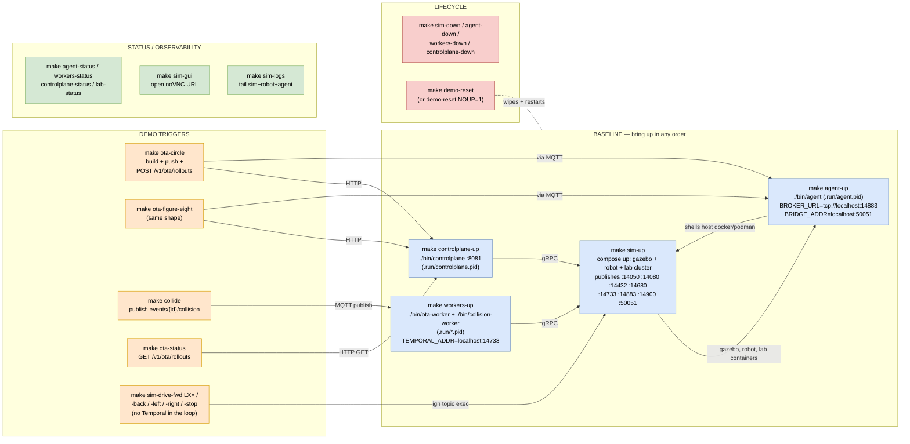

# temporal-hack

Robotics fleet management platform — Telemetry + OTA MVP. ROS 2 +
Gazebo + Temporal + MQTT. The architecture, decision record, and
project plan live in [`specs/`](specs/) — read those first.

## Layout

```
cloud/        Go control plane (HTTP API + telemetry ingester +
              ota-worker + collision-worker)
agent/        Go robot agent (MQTT publisher, SQLite buffer,
              OTA executor)
bridge/       Python ROS 2 bridge node + sim_battery + collision /
              twist MQTT helpers
proto/        protobuf contracts (telemetry, agent ↔ bridge, OTA)
docker/
  gazebo/     simulator container — gz sim + ros_gz_bridge + GUI
  robot/      always-on ROS infrastructure container
  dummy-robot/ minimal OTA placeholder image (lab smoke)
sim/
  controllers/ OTA-swappable robot-app images
                (drive-circle, drive-figure-eight)
installer/    docker-compose (lab) + helm (prod stub)
deploy/       service config baked into the installer
specs/        blueprint artifacts (decisions, threats, plan, ADRs)
ops/          runbooks
```

## Service shape

The runtime splits across **three containers** + **four host-side
processes**. The agent owns the OTA path: it shells out to the host
docker/podman CLI to pull, run, swap, and roll back the
**robot-app** container — which runs alongside the others on the lab
network and joins the same ROS DDS domain.



Bold orange edges are the OTA path: the agent shells out to the host
engine, which pulls from the lab registry and swaps the robot-app
container in place.

### OTA flow

```mermaid
sequenceDiagram
    autonumber
    actor Op as operator (curl / make ota-*)
    participant Cp as controlplane
    participant Ow as ota-worker
    participant Tmp as Temporal
    participant MQ as MQTT (EMQX)
    participant Ag as agent (host)
    participant Eng as docker/podman (host)
    participant App as robot-app (container)

    Op->>Cp: POST /v1/ota/rollouts
    Cp->>Tmp: StartWorkflow OTARollout
    Tmp-->>Ow: dispatch task
    Ow->>MQ: publish cmd/{robot_id}/ota
    MQ-->>Ag: deliver
    Ag->>Eng: pull image_ref
    Ag->>MQ: ack PHASE_PULLED
    Ag->>Eng: run new (temp name)
    Ag->>Eng: rm old; rename new
    Ag->>MQ: ack PHASE_SWAPPED
    Eng->>App: container starts
    Ag->>Eng: exec smoke_command
    Ag->>MQ: ack PHASE_HEALTHY
    MQ-->>Ow: signal workflow per phase
    Ow->>Tmp: RecordRolloutEnded(completed)
    Cp-->>Op: GET /v1/ota/rollouts → completed
```

### Collision flow



## Make-target interaction map

The four bring-up targets in the **baseline** lane are the ones you
run; everything else either depends on those or operates on them.
Demo triggers (right column) need the baseline lane up to function.



### Quickstart

Requires Go 1.22+, Python 3.10+, and either Docker or Podman with
compose. The Makefile auto-detects the container engine.

```bash
make sim-up               # lab cluster + gazebo + robot   (~5 min first build)
make agent-up             # native agent on macOS host
make workers-up           # ota-worker + collision-worker
make controlplane-up      # OTA HTTP API on :8081
make sim-gui              # open the Gazebo browser GUI
```

That's the whole baseline. Tear down:

```bash
make controlplane-down && make workers-down && make agent-down && make sim-down
# OR, full wipe + restart in one shot:
make demo-reset
```

## Drive demo (no Temporal in the loop)

```bash
make sim-drive-fwd        # 0.5 m/s for ~0.5s (DiffDrive holds last cmd)
make sim-drive-fwd LX=2   # faster
make sim-drive-left
make sim-drive-stop
```

These publish straight to the in-container Ignition topic via
`ign topic` — no ROS install needed on the host.

## OTA demo (Temporal swaps a robot-app live)

```bash
make ota-circle           # build sim/controllers/drive-circle, push,
                          # POST /v1/ota/rollouts → rover starts circling
make ota-figure-eight     # swap to figure-8 controller
make ota-status           # GET /v1/ota/rollouts (jq if installed)
```

What you'll see: a `rollout-…` workflow appears at
`http://localhost:14080/namespaces/default/workflows`, completes in
1–2 seconds, and the `robot-app` container under `podman ps` flips to
the new image. The rover's behaviour changes immediately.

The full data path for a rollout — see the **OTA flow** sequence
diagram in *Service shape* above. The agent is the only process that
runs `podman pull / run / rename`; workers never touch the host
engine, they orchestrate via MQTT.

## Collision demo (Temporal drives the rover out of an obstacle)

The moon world spawns the rover with a 0.9 m boulder at `x = 8` —
drive the rover into it (or fake the event) and a Temporal
`CollisionResponse` workflow runs back-up → 90° turn-right → forward.

```bash
make collide              # publish a fake collision event;
                          # workflow starts immediately
# OR drive into the boulder for real:
make sim-drive-fwd LX=1.0 # send the cmd a few times until impact
```

Watch the `collision-…` workflow at `http://localhost:14080`.

## Make-target reference

### Lab cluster (compose)

| target | what |
|--------|------|
| `sim-up` | gazebo + robot + lab cluster (Postgres, Temporal, EMQX, registry) |
| `sim-up-headless` | same as `sim-up` but no GUI |
| `sim-down` / `sim-logs` | tear down / tail |
| `sim-gui` | open noVNC URL in default browser |
| `lab-up` / `lab-down` / `lab-status` / `lab-reset` | lab cluster only (no sim) |

### Host-side processes (Go binaries)

| target | what |
|--------|------|
| `agent-up` / `agent-down` / `agent-status` | the agent (native, preferred) |
| `workers-up` / `workers-down` / `workers-status` | ota-worker + collision-worker |
| `controlplane-up` / `controlplane-down` / `controlplane-status` | HTTP API on :8081 |

### Drive helpers

| target | what |
|--------|------|
| `sim-drive-fwd LX=` | direct gz `cmd_vel` publish |
| `sim-drive-back` / `sim-drive-left` / `sim-drive-right` / `sim-drive-stop` | same |

### Demos

| target | what |
|--------|------|
| `ota-circle` / `ota-figure-eight` | build + push + roll out one of the PR #7 controllers |
| `ota-status` | list recent rollouts |
| `collide` | publish a fake collision event; triggers Temporal `CollisionResponse` |
| `dummy-robot-image` | build + push a no-op alpine OTA image |

### Build / lint / test

| target | what |
|--------|------|
| `build` | both Go modules → `bin/` |
| `tidy` | `go mod tidy` for both modules |
| `lint` | `go vet` (+ `staticcheck` if installed) |
| `test` | `go test -race -count=1` |
| `proto` | regenerate Go + Python protobuf bindings via containerized protoc |

### CI smoke (alternate ports for local CI parity)

| target | what |
|--------|------|
| `ci-up` / `ci-down` / `ci-status` | CI cluster on `2xxxx` ports (so it can run alongside `lab-up`) |

### Hooks + meta

| target | what |
|--------|------|
| `hooks-install` / `hooks-uninstall` | git hooks at `.git-hooks/` (auto-installed on every `make`) |
| `container-info` | which container engine + compose command was detected |
| `help` | this list |

## Default lab ports

| service | port | notes |
|---------|------|-------|
| Postgres | 14432 | TimescaleDB; same instance hosts Temporal + telemetry |
| Temporal frontend | 14733 | gRPC for workers |
| Temporal UI | 14080 | http://localhost:14080 |
| MQTT broker (EMQX) | 14883 | anonymous in lab; mTLS gated to S5–S6 (D-11) |
| MQTT dashboard | 14093 | http://localhost:14093 (admin / lab-only) |
| Container registry | 14050 | `localhost:14050/robot-app:tag` |
| Gazebo noVNC | 14680 | http://localhost:14680/vnc.html?autoconnect=1&resize=scale |
| Gazebo VNC | 14900 | raw VNC for native clients |
| Robot bridge gRPC | 50051 | published so the native agent reaches `localhost:50051` |
| Control plane API | 8081 | OTA rollouts |

CI cluster mirrors the same services on the `2xxxx` range so `lab-up`
and `ci-up` can coexist on one host.

## Sprint status

| Sprint | Theme | Status |
|--------|-------|--------|
| S0 | Foundations + installer | landed (Postgres + Temporal + MQTT + registry on `make lab-up`) |
| S1 | Telemetry plumbing | landed (bridge_node ↔ agent over gRPC, MQTT publish) |
| S2 | Telemetry MVP | landed (SQLite buffer, TimescaleDB hypertable, operator API) |
| S3–S4 | OTA workflow + swap + rollback | landed (Temporal workflows, robot-app OTA targets) |
| Demo | Collision response + OTA controllers | landed (CollisionResponse workflow, drive-circle / drive-figure-eight) |
| S5–S6 | Identity (mTLS, signed images) | **gates customer ship** — see `specs/in-process/identity-mtls.md` |

See [`specs/project-plan.md`](specs/project-plan.md) for the full plan.
