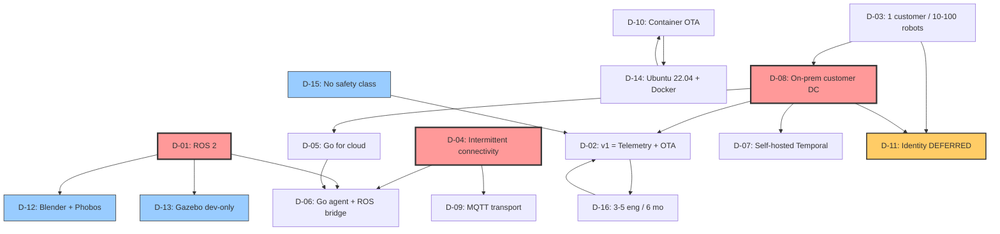

# Phase 0 Decision Tree

This file shows the dependency relationships between confirmed
decisions in `decisions.md`. It identifies the small set of
load-bearing decisions whose change would force re-running blueprint
phases, and the larger set of leaf decisions that can be revised
without cascading impact.

## Dependency graph

Legend: red = load-bearing (changes cascade widely); orange = risk
flag (deferral); blue = leaf decision (can be revised cheaply).

## Load-bearing decisions

These three decisions shape almost everything downstream. Changing any
of them forces re-blueprinting at least Phase 1 (architecture) and
Phase 2 (DSM):

### D-01: ROS 2
- Gates D-06 (robot agent design — bridge node uses rclcpp/rclpy)
- Gates D-12 (URDF tooling targets ROS 2's URDF/Xacro format)
- Gates D-13 (Gazebo version compatibility with ROS 2)
- Reversal cost: **HIGH.** Every on-device design choice depends on it.

### D-04: Intermittent connectivity
- Gates D-09 (MQTT chosen for store-and-forward; alternatives fail
  this test)
- Gates D-06 (agent must buffer locally; offline-tolerant by design)
- Gates v1 scope shape: teleop relegated to best-effort, mission
  dispatch deferred
- Reversal cost: **HIGH.** Always-on connectivity unlocks simpler
  transports (gRPC streaming) and tighter cloud coupling, but the
  whole agent and broker design assume intermittent.

### D-08: On-prem customer DC
- Gates D-07 (no Temporal Cloud)
- Gates D-05 (no managed worker hosting)
- Gates D-11 (identity becomes mTLS in customer-controlled PKI)
- Forces installer / platform-update mechanism (no managed deploy)
- Forces every dependency to ship in our bundle (no managed services)
- Reversal cost: **VERY HIGH.** Adding a SaaS variant later is a
  separate product, not a code change.

## Risk-flagged decision

### D-11: Identity deferred
This is the only intentional deferral. It cascades into every
authenticated surface (D-09 broker auth, D-10 image signing, D-06 agent
enrollment, future teleop signaling). The **architecture must not bake
in unauthenticated assumptions** — every protocol surface is designed
with an mTLS-shaped seam, even if v1 ships with pre-shared tokens
behind that seam. This is a recurring constraint Phase 2 must enforce.

## Leaf decisions (cheap to revise)

These can be changed without cascading impact:

| Decision | Why it's a leaf |
|----------|-----------------|
| D-12 (Blender + Phobos) | URDF format is portable; tooling can be swapped without code changes elsewhere |
| D-13 (Gazebo dev-only) | Sim is not on any production path; can expand to CI later without re-architecting |
| D-15 (no safety class) | If safety becomes a requirement, it's a separate compliance program; doesn't invalidate v1 architecture |
| Specific MQTT broker vendor | Deferred to Phase 2 — interface is MQTT, vendor is implementation detail |
| Specific TSDB vendor | Same — interface is via collector / writer abstraction |

## Forward feed to Phase 1 (Architecture)

Phase 1 (`/architect init`) must consume:
- All 16 confirmed decisions as constraints, not assumptions
- The two defaulted assumptions (A-01, A-02) as design tolerances
- The risk register as items to surface in `overview.md` risks section
- Specifically: identity-deferred (D-11) as a recurring "design with
  mTLS-shaped seams" constraint

## Forward feed to later phases

| Phase | Receives |
|-------|----------|
| 1 (Architect) | All decisions as constraints; A-01/A-02 as tolerances |
| 2 (DSM) | D-05/D-06 module split (cloud Go vs robot agent + bridge) |
| 3 (Threat Model) | D-11 (identity) drives most of the model |
| 4 (FMEA) | D-04 connectivity drives most failure modes |
| 5 (Hazards) | D-05 (Go) selects which language hazards apply |
| 5b (Pipeline Defense) | Deferred — no CI yet |
| 5c (Code Scan) | Empty — greenfield |
| 6 (Project Plan) | D-02, D-16 set sprint shape and capacity |
| 7-9 (Tests) | D-13 (sim dev-only) shapes integration test strategy |
| 10 (Compile Plan) | D-08 forces installer as first compiled work item |
