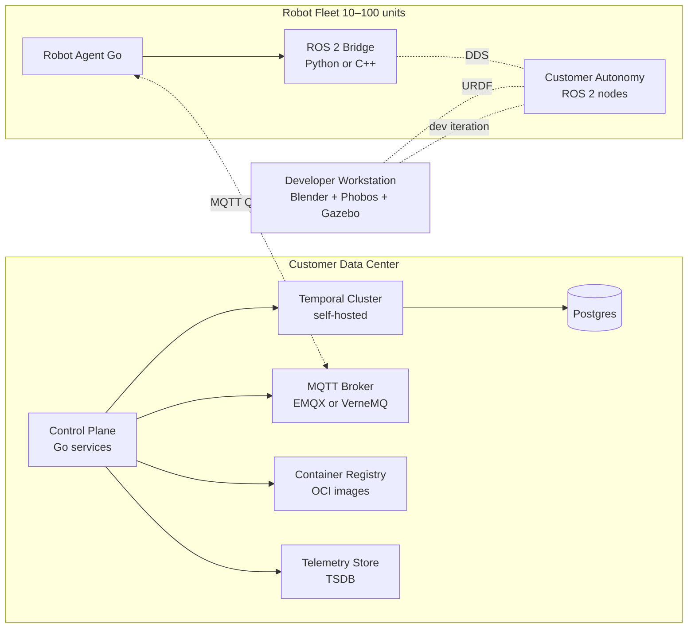

# Architecture Overview

This is the v1 architecture, derived from the sixteen Phase 0
decisions in `decisions.md`. It is the reference for all subsequent
phase artifacts (DSM, threat model, FMEA, project plan).

## System context



## Component inventory

### Cloud side (in customer DC)

| Component | Language / Tech | Responsibility |
|-----------|-----------------|----------------|
| Control plane | Go | Fleet registry, OTA orchestrator, telemetry ingest, REST/gRPC API for operators |
| Temporal cluster | Temporal OSS, self-hosted | Durable workflow execution: OTA rollouts, retries, rollback orchestration |
| Postgres | PostgreSQL 15+ | Temporal persistence, control-plane state |
| MQTT broker | EMQX or VerneMQ (TBD) | Telemetry transport with persistent sessions and store-and-forward |
| Container registry | Harbor / Distribution / Zot (TBD) | Hosts OTA artifact images |
| Telemetry store | TimescaleDB / VictoriaMetrics / Prometheus (TBD) | Long-term storage of robot metrics and events |
| Installer / platform-update mechanism | Helm / Ansible / k3s-flavored (TBD) | Ships our software to customer; updates the platform itself |

### Robot side (per Ubuntu 22.04 + Docker)

| Component | Language | Responsibility |
|-----------|----------|----------------|
| Robot agent | Go | Maintain MQTT connection, buffer telemetry during disconnect, execute OTA updates, report health |
| ROS 2 bridge node | Python or C++ (rclpy / rclcpp) | Subscribe to selected DDS topics, republish via gRPC over Unix socket |
| Customer autonomy stack | C++ / Python (ROS 2 nodes) | Out of scope; customer's responsibility |

### Developer toolchain

| Component | Tech | Responsibility |
|-----------|------|----------------|
| URDF authoring | Blender + Phobos plugin | Model robot, export URDF / Xacro |
| Local sim | Gazebo | Workstation iteration only; no CI sim, no farm |

## Critical data flows

### Telemetry path (robot → cloud)

```
ROS 2 nodes ─DDS topic─▶ ROS 2 bridge ─gRPC UDS─▶ Robot agent
                                                       │
                                              local SQLite buffer
                                              (intermittent)
                                                       │
                                                   MQTT QoS 1/2
                                                       │
                                                       ▼
                                                  MQTT broker
                                                       │
                                          subscriber: telemetry-ingest
                                                       │
                                                       ▼
                                                  Telemetry store
```

**Properties:**
- Telemetry is loss-tolerant for individual samples but lossless at
  the message level (broker persists, agent retries).
- Disconnect of hours is acceptable; agent buffers locally with a
  bounded ring buffer to cap disk usage.
- No Temporal involvement — telemetry is a streaming pipeline, not a
  workflow.

### OTA path (cloud → robot)

```
Operator API ─▶ Control Plane ─▶ Temporal workflow (rollout)
                                       │
                          1) Resolve target image tag
                          2) For each robot in cohort:
                                a) Publish MQTT command (with QoS 1)
                                b) Wait for ACK (timer-bounded)
                                c) Wait for health check
                                d) On failure → rollback child workflow
                                e) Record outcome
                                       │
                                       ▼
Robot agent ─▶ pull image from registry (over MQTT-signaled URL)
            ─▶ swap container
            ─▶ run smoke check
            ─▶ ACK / NACK via MQTT
            ─▶ on failure: revert to previous container, signal NACK
```

**Properties:**
- Rollout cohort policy (canary, batched, full-fleet) lives in the
  Temporal workflow definition.
- Rollback is a child workflow with its own retry semantics.
- Image signature verification is an mTLS-shaped seam (see D-11):
  v1 uses TLS to the registry only; production gates require signed
  images verified by a customer-controlled key.

## Constraints (carried forward from Phase 0)

1. Architecture must function under intermittent connectivity (D-04).
   No design that requires synchronous cloud round-trips on the robot
   data path is acceptable.
2. Every authenticated surface must be designed with an mTLS seam,
   even if v1 ships pre-shared tokens behind it (D-11). Adding
   authentication later must not require re-architecting.
3. No managed-service dependencies. Every external dependency
   must ship in the installer bundle (D-08).
4. The platform itself needs an update mechanism (D-08). Sprint 0
   delivers an installer; ongoing version delivery is part of the
   ops surface.
5. ROS does not appear in the Go agent (D-06). The bridge node owns
   all DDS interaction.
6. v1 scope is Telemetry + OTA. Mission dispatch and teleop are
   non-goals (D-02).

## Open architecture decisions (ADR placeholders)

To be resolved in Phase 2:

| ADR | Topic | Constraint |
|-----|-------|------------|
| ADR-001 | MQTT broker selection | EMQX vs VerneMQ vs Mosquitto cluster; persistent session capacity, HA model |
| ADR-002 | Container registry | Harbor / Distribution / Zot; signing / verification path |
| ADR-003 | Telemetry storage | TimescaleDB vs VictoriaMetrics vs Prometheus + Mimir; retention / cardinality |
| ADR-004 | Bridge node language | Python (rclpy, faster delivery) vs C++ (rclcpp, more efficient) |
| ADR-005 | Installer toolchain | Helm-on-k3s vs Ansible vs custom |
| ADR-006 | Local-buffer durability format on robot | SQLite vs filesystem queue vs embedded NATS |
| ADR-007 | OTA artifact swap mechanism | Recreate vs blue-green container; health check definition |

## Risks (from Phase 0)

See `decisions.md` for the full risk register. Highest-impact items:
- R-01: Identity deferred (HIGH) — gates customer deployment
- R-02: On-prem ops tax (HIGH) — installer is sprint 0
- R-04: MQTT broker durability (MEDIUM) — ADR-001 closes
- R-05: Customer DC connectivity unconfirmed (MEDIUM) — confirm at
  first customer engagement

## Out of scope (v1)

- Multi-tenancy
- Public-cloud deployment
- Mission dispatch (deferred to v1.5)
- Remote teleop (deferred to v2; best-effort when connected)
- Sim in CI; sim farm; synthetic data pipeline
- Functional safety certification

## Phase 1 status

This overview is the Phase 1 deliverable. Next phase (DSM) analyzes
module boundaries between the Go cloud control plane, the Go robot
agent, and the bridge node — looking for premature coupling and the
right place to draw the gRPC contract between agent and bridge.
