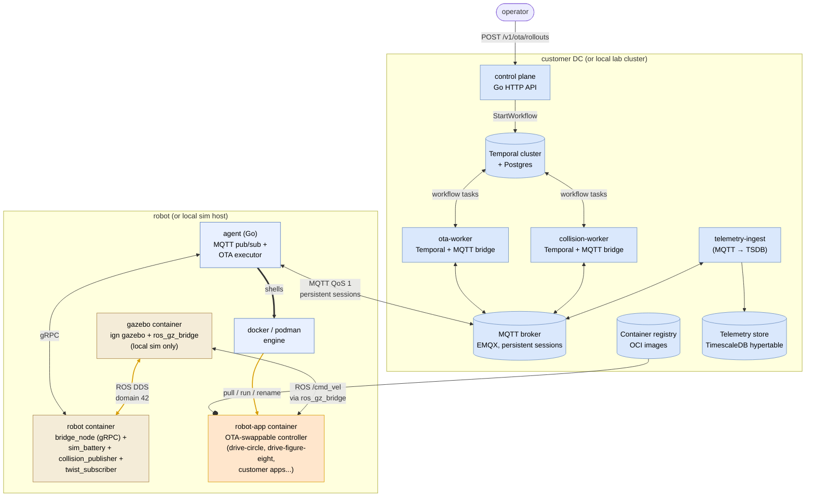
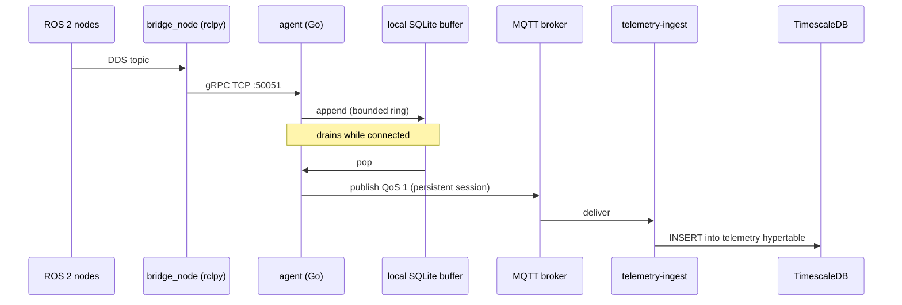
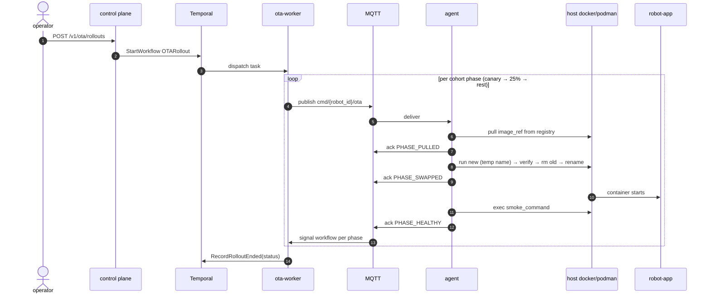
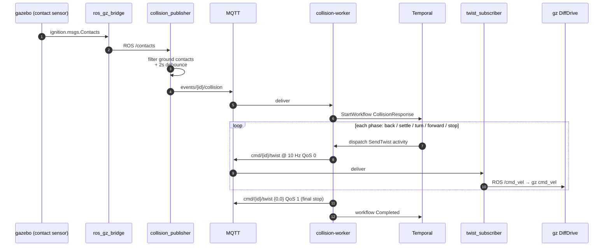

# Architecture Overview

This is the v1 architecture, derived from the sixteen Phase 0
decisions in `decisions.md`. It is the reference for all subsequent
phase artifacts (DSM, threat model, FMEA, project plan).

## System context

The cloud / robot split as of the demo cut. Production
("customer DC") and dev-loop sim ("local Mac") share the same
component shape — only the substrate (Kubernetes vs `make sim-up`)
and the simulator role differ.

In production the gazebo container is absent (real robots, real
sensors). Everything else — agent, robot-container infra, MQTT path,
the cloud workers — is identical between dev sim and production.

## Component inventory

### Cloud side (in customer DC)

| Component | Language / Tech | Responsibility |
|-----------|-----------------|----------------|
| Control plane | Go | Fleet registry, OTA orchestrator, telemetry ingest, REST/gRPC API for operators |
| Temporal cluster | Temporal OSS, self-hosted | Durable workflow execution: OTA rollouts, retries, rollback orchestration |
| Postgres | PostgreSQL 15+ | Temporal persistence, control-plane state |
| MQTT broker | EMQX or VerneMQ (TBD) | Telemetry transport with persistent sessions and store-and-forward |
| Container registry | Harbor / Distribution / Zot (TBD) | Hosts OTA artifact images |
| Telemetry store | TimescaleDB / VictoriaMetrics / Prometheus (TBD) | Long-term storage of robot metrics and events |
| Installer / platform-update mechanism | Helm / Ansible / k3s-flavored (TBD) | Ships our software to customer; updates the platform itself |

### Robot side (per Ubuntu 22.04 + Docker)

The robot now runs **three** containers per host, not one. The
agent is a sibling Go binary outside the compose lifecycle (in the
dev demo it runs natively on the macOS host; in production it
ships as a systemd unit).

| Component | Language | Container? | Responsibility |
|-----------|----------|-----------|----------------|
| **gazebo** (sim only) | C++ / Python | container | ign gazebo + ros_gz_bridge + Xvfb / x11vnc / noVNC. Absent on a real robot. |
| **robot** (always-on infra) | Python (rclpy) | container | bridge_node (rclpy → gRPC TCP :50051), sim_battery (sim only), collision_publisher (ROS /contacts → MQTT), twist_subscriber (MQTT → ROS /cmd_vel). |
| **robot-app** (OTA target) | any (ROS 2 image) | container | The replaceable controller. drive-circle, drive-figure-eight in dev; customer autonomy code in production. The agent OTAs this image; everything else is static between releases. |
| robot agent | Go | host binary | Maintain MQTT connection, buffer telemetry during disconnect, execute OTA updates via the host docker/podman CLI, report health. |

The agent owns the path from MQTT command → host engine → robot-app.
Workers in the cloud orchestrate via MQTT; only the agent ever
shells out to the host's container engine.

### Developer toolchain

| Component | Tech | Responsibility |
|-----------|------|----------------|
| URDF authoring | Blender + Phobos plugin | Model robot, export URDF / Xacro |
| Local sim | Gazebo | Workstation iteration only; no CI sim, no farm |

## Critical data flows

### Telemetry path (robot → cloud)

**Properties:**
- Telemetry is loss-tolerant for individual samples but lossless at
  the message level (broker persists, agent retries).
- Disconnect of hours is acceptable; agent buffers locally with a
  bounded ring buffer to cap disk usage.
- No Temporal involvement — telemetry is a streaming pipeline, not a
  workflow.

### OTA path (cloud → robot)

**Properties:**
- Rollout cohort policy (canary, batched, full-fleet) lives in the
  Temporal workflow definition.
- Rollback is a child workflow with its own retry semantics; the
  agent always emits PHASE_ROLLED_BACK so the rollback workflow
  terminates instead of timing out.
- Image signature verification is an mTLS-shaped seam (see D-11):
  v1 uses TLS to the registry only; production gates require signed
  images verified by a customer-controlled key.

### Collision-response path (robot → cloud → robot)

This is the demo wiring used to show that a Temporal workflow can
own a recovery sequence in response to a robot-side event.

**Properties:**
- Twist commands ride MQTT QoS 0 at 10 Hz; the final stop frame is
  QoS 1 so the rover always settles even if a tail QoS 0 packet
  drops.
- Workers run with `clean_session=true`. A missed collision event
  is fine (the next contact emits another); persistent-session
  replay floods the bridge after restart.
- The collision_publisher filters out ground-plane contacts so the
  rover's resting weight doesn't trigger a workflow on every sim
  tick.

## Constraints (carried forward from Phase 0)

1. Architecture must function under intermittent connectivity (D-04).
   No design that requires synchronous cloud round-trips on the robot
   data path is acceptable.
2. Every authenticated surface must be designed with an mTLS seam,
   even if v1 ships pre-shared tokens behind it (D-11). Adding
   authentication later must not require re-architecting.
3. No managed-service dependencies. Every external dependency
   must ship in the installer bundle (D-08).
4. The platform itself needs an update mechanism (D-08). Sprint 0
   delivers an installer; ongoing version delivery is part of the
   ops surface.
5. ROS does not appear in the Go agent (D-06). The bridge node owns
   all DDS interaction.
6. v1 scope is Telemetry + OTA. Mission dispatch and teleop are
   non-goals (D-02).

## Closed architectural decisions (ADRs)

| ADR | Decision | Status |
|-----|----------|--------|
| ADR-001 | MQTT broker = EMQX 5.x (lab) | accepted; see `specs/adr/ADR-001-mqtt-broker.md` |
| ADR-002 | Container registry = Distribution (`registry:2`) | accepted |
| ADR-003 | Telemetry storage = TimescaleDB hypertable | accepted |
| ADR-004 | Bridge node = Python rclpy | accepted |
| ADR-005 | Installer toolchain | open (Sprint 8) |
| ADR-006 | Local-buffer durability format on robot = SQLite (WAL) | accepted (in code) |
| ADR-007 | OTA artifact swap mechanism = blue-green | accepted; see `specs/adr/ADR-007-ota-swap-strategy.md` |
| ADR-008 | OTA command/ack transport = MQTT topic pair | accepted; see `specs/adr/ADR-008-ota-command-transport.md` |

## Risks (from Phase 0)

See `decisions.md` for the full risk register. Highest-impact items:
- R-01: Identity deferred (HIGH) — gates customer deployment
- R-02: On-prem ops tax (HIGH) — installer is sprint 0
- R-04: MQTT broker durability (MEDIUM) — ADR-001 closes
- R-05: Customer DC connectivity unconfirmed (MEDIUM) — confirm at
  first customer engagement

## Out of scope (v1)

- Multi-tenancy
- Public-cloud deployment
- Mission dispatch (deferred to v1.5)
- Remote teleop (deferred to v2; best-effort when connected)
- Sim in CI; sim farm; synthetic data pipeline
- Functional safety certification

## Phase 1 status

This overview is the Phase 1 deliverable, refreshed after the demo
cut (gazebo+robot container split, OTA-swappable robot-app images,
CollisionResponse workflow). Next phase (DSM) analyzes module
boundaries between the Go cloud workers, the agent, and the
robot-side ROS code — looking for premature coupling and the right
place to draw the contracts (gRPC between agent and bridge_node;
MQTT topic schemas between agent and workers).
